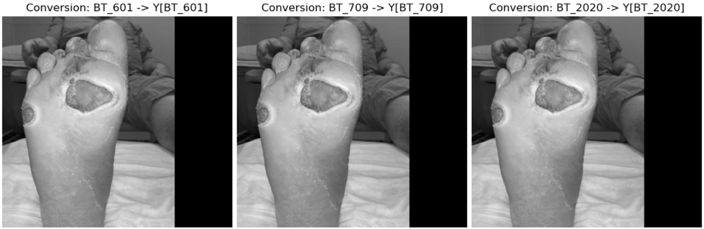
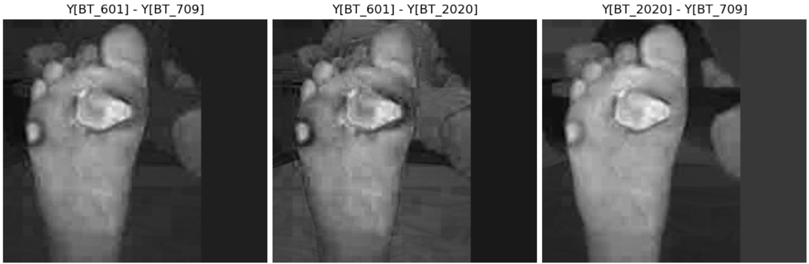
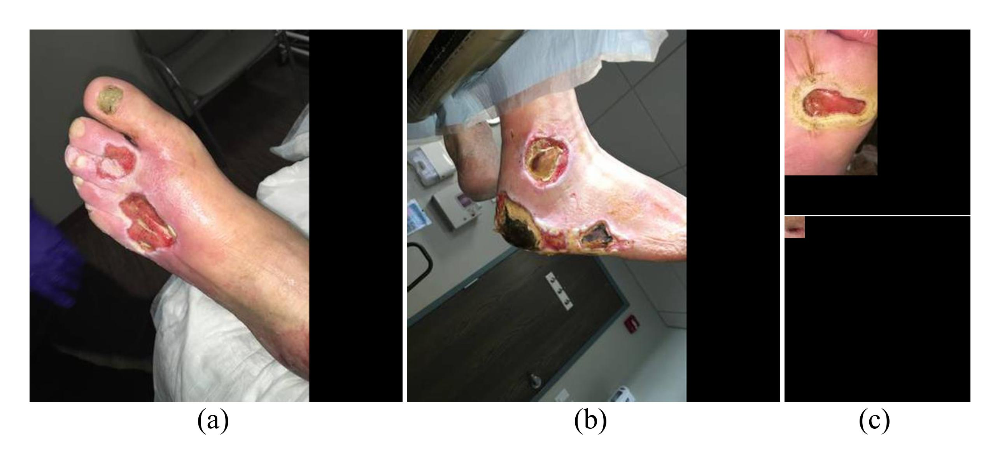
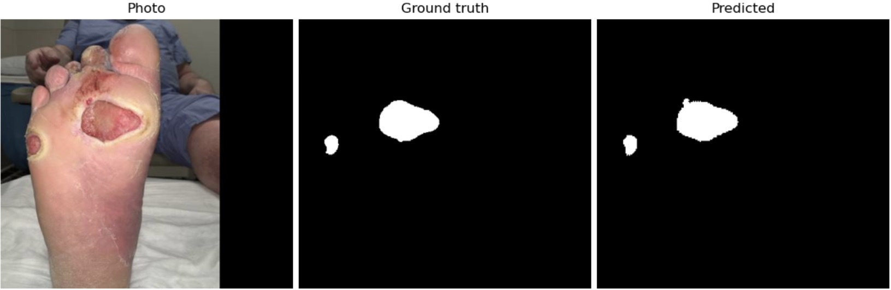
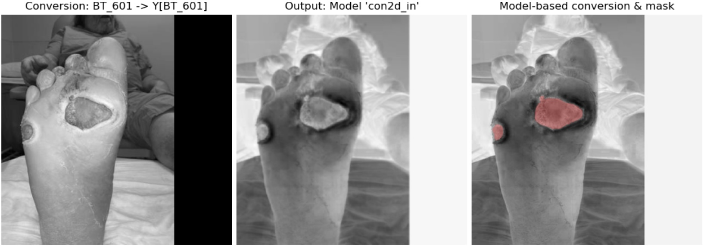

# The Influence of Color in Semantic Ulcer Segmentation Using Deep Learning Models
This study investigates the influence of color on ulcer semantic segmentation. Different color-to-grayscale conversion techniques are explored to study the learning behavior of the CNN model. The goal is to explore different RGB-to-Grayscale conversion techniques and understand their impact on the performance of the CNN model for foot ulcer segmentation.

## RGB to Grayscale conversion outputs using different ITU-R standards
<div align="center">
    <a href="./">
        
    </a>
</div>

<div align="center">
    <a href="./">
        
    </a>
</div>

## Datasets
The following two datasets are used in this experiment.
* [`FUSeg dataset`](https://github.com/uwm-bigdata/wound-segmentation/tree/master/data/Foot%20Ulcer%20Segmentation%20Challenge)
* [`The Chronic wound dataset (AZH)`](https://github.com/uwm-bigdata/wound-segmentation/tree/master/data/wound_dataset)


Examples of wound images from FUSeg and datasets. image (a) and (b)
are from FUSeg, while images in (c) are from the AZH dataset.
<div align="center">
    <a href="./">
        
    </a>
</div>

## Installation

Create a conda environment.
``` shell
conda create --name cfuseg python=3.9.21
conda activate cfuseg
```
Install required packages
``` shell
# pip install required packages
pip install -r requirements.txt
```

## Training

* Data preparation:
we train a model using RGB and different grayscale conversion methods to investigate the influence of color on Foot Ulcer Segmentation.
select image type for input in [train.py](train.py) in ImageLoader.

``` shell
# ----------------------------------------select image type for input------------------
image_loader_train = ImageLoader(img_dir, mask_dir=mask_dir,
                                    image_tform=data_transforms['train'], 
                                    mask_tform=data_transforms['train'], 
                                    imgloader=PIL.Image.open,
                                    image_type='grey_world')  # Options: 'rgb', 'weights', 'PIL', 'grey_world'
```
* Run [train.py](train.py) to train a custom model.
* You can select different models to train on custom data.

``` shell
# Open terminal in the directory and run to start training
python train.py
```

# Testing
To regenerate testing results, pre-trained models can be downloaded from [pretrained_model](pretrained_model/)
``` shell
# for testing and inference using pre-trained weights
python test_and_inference.ipynb
```
## Results
An example of the original photography of a foot ulcer, ground
truth mask and predicted mask usingthe  UNet-VGG model with learned weights
for color-to-grayscale conversion

<div align="center">
    <a href="./">
        
    </a>
</div>

From left: the result of color image preprocessing (conversion to grayscale using the BT-601 standard), the output of the first layer of the UNet VGG model (Conv2D with kernel size=1 and no bias), the output of the color image conversion using weights of the first layer with the overlaid, predicted ulcer segment.

<div align="center">
    <a href="./">
        
    </a>
</div>

